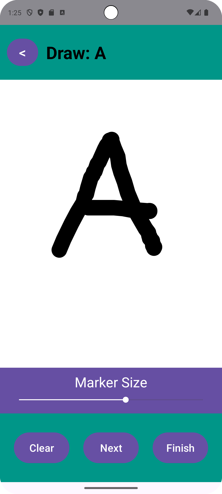
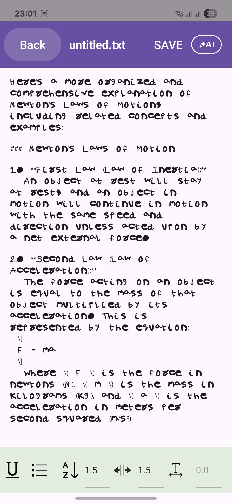
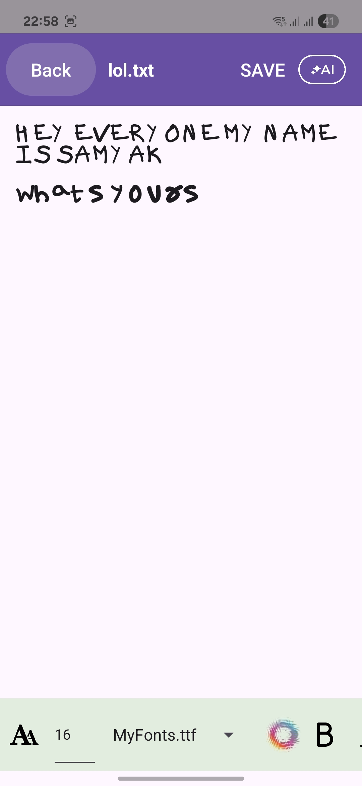
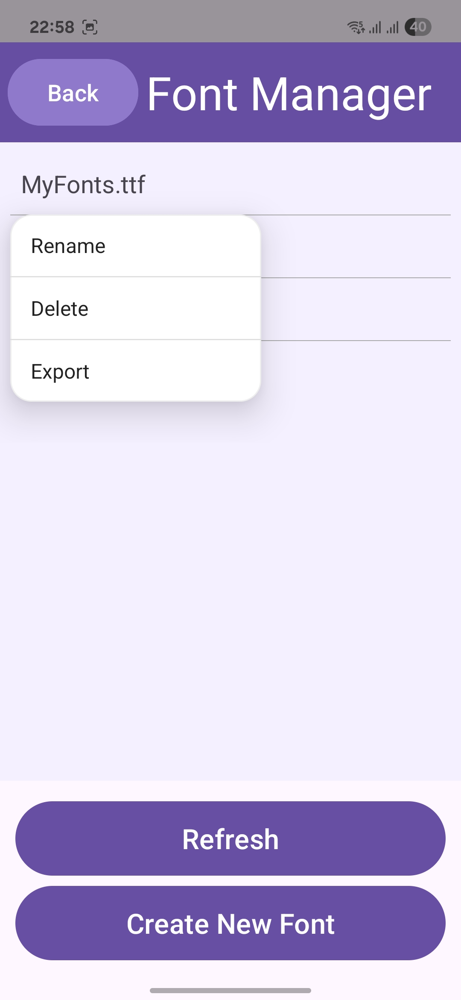
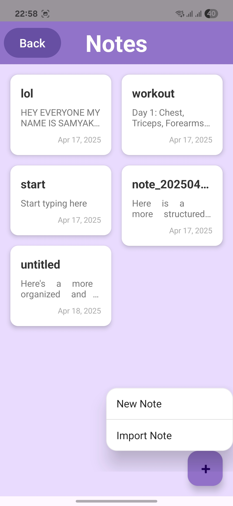
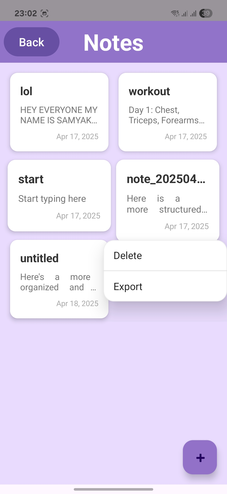

# TextToHandwriting


TextToHandwriting is an Android application that transforms your handwritten alphabet into a custom TrueType font file. The app features AI-powered text formatting through GPT-4o integration for intelligent styling and content generation. Users draw each character on a mobile canvas, which gets processed by a Spring Boot backend service that vectorizes the strokes using FontForge and Potrace, ultimately generating a downloadable .ttf font file ready for installation and use.

  <div align="center">
    <div>
      
      
    </div>
    <div>
      
      
    </div>
    <div>
      
      
    </div>
  </div>

## Features

- **Character Recognition**: Drawing canvas with adjustable brush sizes and real-time feedback
- **Font Generation**: Complete TTF font creation using FontForge and Potrace integration  
- **AI Text Formatting**: GPT-4o integration for intelligent text styling and formatting, also answers queries
- **Cross-Platform Architecture**: Spring Boot backend with Android frontend
- **Secure Configuration**: Industry-standard security practices for API keys and network communication
- **Rich Text Editor**: Full-featured note editor with custom font support

## Architecture

```
├── src/
│   ├── android/           # Android application source
│   └── backend/           # Spring Boot REST API
├── docs/                  # Project documentation
│   ├── api/              # API documentation
│   ├── setup/            # Setup guides
│   └── architecture/     # Architecture diagrams
├── assets/               # Media assets and screenshots
├── tests/                # Test suites
└── resources/            # Configuration templates
```

## Quick Start

### Prerequisites

- **Android Development**
  - Android Studio
  - Android SDK 24+ (Android 7.0)
  - Gradle 7.0+

- **Backend Services**
  - Java 17+ (OpenJDK recommended)
  - Maven 3.8+
  - Python 3.8+
  - FontForge (Windows/Linux/macOS)
  - Potrace vector graphics utility

### Installation

1. **Clone the repository**
   ```bash
   git clone https://github.com/samyak0510/TextToHandwriting.git
   cd TextToHandwriting
   ```

2. **Backend Setup**
   ```bash
   cd src/backend
   mvn clean install
   mvn spring-boot:run
   ```
   Server starts on `http://localhost:8080`

3. **Android Setup**
   - Open `src/android/` in Android Studio
   - Sync project with Gradle files
   - Configure your OpenAI API key (see Security Configuration)
   - Build and run on device/emulator

4. **External Dependencies**
   - Install FontForge: [Download Here](https://fontforge.org/en-US/downloads/)
   - Install Potrace: [Download Here](http://potrace.sourceforge.net/)

## Configuration

### Environment Variables
Create `src/backend/src/main/resources/application.properties`:
```properties
# Font Processing Paths (auto-detected)
fontforge.path=${FONTFORGE_PATH:auto}
potrace.path=${POTRACE_PATH:auto}
storage.directory=${STORAGE_DIR:./fonts}

# Server Configuration
server.port=8080
spring.servlet.multipart.max-file-size=50MB
spring.servlet.multipart.max-request-size=50MB
```

### Android Configuration
The app automatically detects your development server IP. For manual configuration, update `src/android/app/src/main/res/values/config.xml`:
```xml
<resources>
    <string name="base_url">http://AUTO_DETECT:8080</string>
    <string name="openai_key_alias">openai_api_key</string>
</resources>
```

## Testing

Run the comprehensive test suite:

```bash
# Backend Tests
cd src/backend
mvn test

# Android Tests
cd src/android
./gradlew test
./gradlew connectedAndroidTest

# Integration Tests
cd tests
python -m pytest integration/
```

## Documentation

- [API Documentation](docs/api/README.md) - Complete REST API reference
- [Setup Guide](docs/setup/README.md) - Detailed installation instructions  
- [Architecture Overview](docs/architecture/README.md) - System design and data flow
- [Contributing Guide](CONTRIBUTING.md) - Development workflow and standards

## Contributing

Please see our [Contributing Guide](CONTRIBUTING.md) for details on:
- Code style and standards
- Development workflow
- Testing requirements
- Pull request process

## License

This project is licensed under the MIT License - see the [LICENSE](LICENSE) file for details.

## Acknowledgments

- [FontForge](https://fontforge.org/) - Font editing software
- [Potrace](http://potrace.sourceforge.net/) - Bitmap tracing utility
- [OpenAI](https://openai.com/) - GPT-4 API for text formatting
- [Spring Boot](https://spring.io/projects/spring-boot) - Backend framework
- [Android Jetpack](https://developer.android.com/jetpack) - Modern Android development

## Issues & Support

Found a bug or need help? Please check our [Issue Tracker](https://github.com/samyak0510/TextToHandwriting/issues) or create a new issue with:
- Device/OS information
- Steps to reproduce
- Expected vs actual behavior
- Relevant logs

---

**Made with ❤️ thanks for checking my work out <3.**
